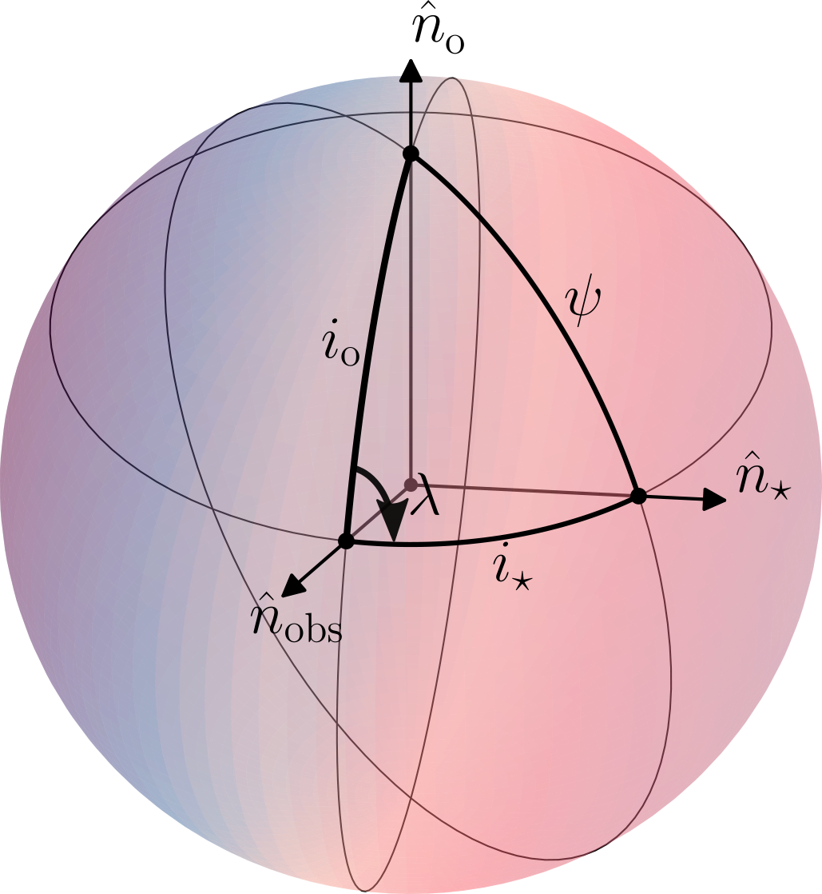

.. _rm:

The Rossiter-McLaughlin effect 
===============================

The Rossiter-McLaughlin (RM) effect is a distortion of the stellar line shapes caused by a transiting body blocking part of the rotating stellar disk. This effect allows us to measure :math:`\lambda`, the sky projection of the stellar obliquity, :math:`\psi`.

	The angles between the stellar spin axis, the orbital axis of a planet, and the observer. 

The geometry of the problem is shown in :numref:`rm_geo`, where :math:`\hat{n}_{\rm obs}`, :math:`\hat{n}_{\rm o}`, and :math:`\hat{n}_\star` are  the unit vectors for the observer, the orbital angular momentum, and the stellar angular momentum.

Planetary shadow
---------------------------

To model the planet shadow we first construct a limb-darkened stellar grid, for instance, by assuming a quadratic limb-darkening law of the form

.. math::
	I = 1 - c_1(1 - \mu) - c_2 (1 - \mu)^2 \, .

Here :math:`\mu=\cos \theta` with :math:`\theta` being the angle between the local normal and a line parallel to the line of sight, and :math:`I` is the local normalized by the intensity at the center of the disc, i.e., :math:`\mu=1`. :math:`c_1` and :math:`c_2` are the linear and quadratic limb-darkening coefficients, respectively. 

Assuming solid body rotation, the radial velocity of the stellar surface is a function of the distance from the stellar spin axis only. If the :math:`x`-axis is along the stellar equator and the :math:`y`-axis parallel to the projected stellar spin axis, then the projected stellar rotation speed at :math:`x` is simply

.. math::
	v_\mathrm{p}=\frac{x}{R} v \sin i \, ,

where :math:`R` is the stellar radius, and :math:`v \sin i` the projected stellar rotation speed. The Doppler velocity of the stellar surface below a planet at :math:`x` is thus :math:`v_\mathrm{p}`.

We then calculate for each time stamp the position of the planet, and if the planet is inside the stellar disk we calculate the line profile for the obscured part of the disk and subtract it from the unobscured disk. 
In each of the pixels in the limb-darkened, the effects of macro-, :math:`\zeta`, and microturbulence, :math:`\xi`, are then accounted for following the approach in :cite:t:`Gray2005`. 
